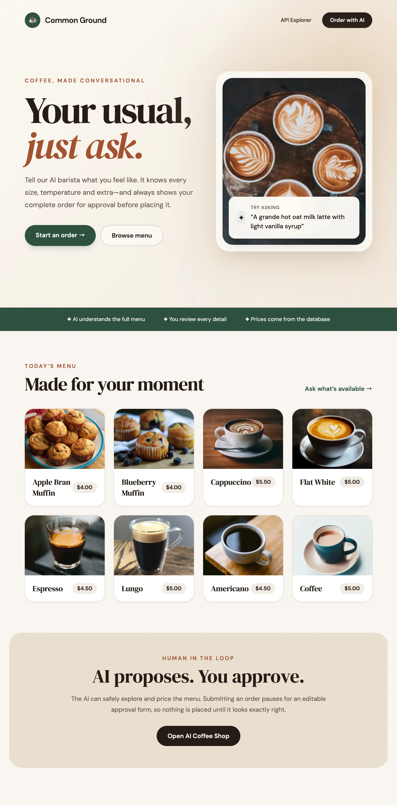

# CoffeeShopChat



**CoffeeShopChat** is a reference demonstration showing how to use [ServiceStack API Tools](https://servicestack.net/posts/api-tools) and the built-in `ChatFeature` to expose existing ServiceStack APIs to AI Models.

With API Tools, AI assistants can discover your APIs, inspect their schemas, price and validate requests, and execute complete workflows (such as ordering coffee) through natural language—all while staying strictly bounded by your C# DTO contracts, declarative validation, and server-side authorization.

In addition to powering the built-in web-based **AI.Chat UI**, CoffeeShopChat exposes these capabilities via a Model Context Protocol (**MCP**) server, allowing external AI clients (like OpenCode, Cursor, Claude Code, and Oh My Pi) to discover and call your APIs directly.

---

## Background & Philosophy

In 2023, natural language API ordering was demonstrated using Microsoft's TypeChat, which required:
1. Writing and maintaining a separate, AI-specific TypeScript schema parallel to .NET backend models.
2. Hardcoding prompt scaffolding and JSON validation retry loops.
3. Invoking a Node.js process from .NET and writing custom mapping logic to convert LLM output into backend DTOs.

### The Single Source of Truth
**ServiceStack API Tools** turn that approach inside out:
- **No Parallel Schemas**: Your typed C# Request/Response DTOs, declarative validation attributes (`[ValidateNotEmpty]`, `[ValidateGreaterThan]`), routes, and authorization rules serve as the single source of truth.
- **Dynamic & Adaptive**: Modern LLMs are smart enough to discover capabilities dynamically when presented with rich metadata. As models improve, your AI workflows improve without requiring codebase changes.
- **Human-in-the-Loop Approval**: Write operations present interactive, schema-driven approval forms where users can review and modify generated parameters (e.g., quantities, size, options) before executing database writes.

---

## How API Tools Work

Rather than dumping hundreds of API schemas into the LLM context window upfront, ServiceStack exposes **three lightweight meta-tools**:

1. **`api_search`**: Searches the API registry using keywords and intent descriptions to find relevant endpoints.
2. **`api_describe`**: Returns exact Request/Response JSON Schemas, routes, safety levels, and workflow metadata for selected APIs.
3. **`api_call`**: Invokes the target API through ServiceStack's in-process Service Gateway as the authenticated user.

### Standard AI Workflow Pattern

```text
Search → Describe → Resolve Current Data → Preview & Validate → Approve → Execute → Verify
```

For a coffee order (e.g., *"Order two grande hot oat milk lattes with light vanilla syrup for Sam"*):
1. **Search**: The LLM searches for coffee shop ordering APIs via `api_search`.
2. **Describe**: It inspects `GetCoffeeShopMenu`, `PreviewCoffeeShopOrder`, and `CreateCoffeeShopOrder` via `api_describe`.
3. **Resolve Menu**: It calls `GetCoffeeShopMenu` to get live product IDs, available sizes, temperatures, and options.
4. **Preview**: It calls `PreviewCoffeeShopOrder` to validate combinations and compute exact subtotal prices.
5. **Approve**: For write operations (`RequiresApproval = true`), AI.Chat presents an editable approval form to the user.
6. **Execute**: Upon user approval, `CreateCoffeeShopOrder` creates the order in the RDBMS.
7. **Verify**: The order confirmation and order ID (e.g., `CS-20260811-A1B2C3`) are returned to the user.

---

## Key Code Components

### 1. Enabling Chat & MCP Features (`MyApp/Configure.AI.Chat.cs`)

Enabling AI.Chat and exposing APIs via MCP requires registering `ChatFeature`:

```csharp
using ServiceStack.AI;

[assembly: HostingStartup(typeof(MyApp.ConfigureAiChat))]

namespace MyApp;

public class ConfigureAiChat : IHostingStartup
{
    public void Configure(IWebHostBuilder builder) => builder
        .ConfigureServices(services =>
        {
            services.AddPlugin(new ChatFeature
            {
                RequireAuth = true,
                AuthType = ChatAuthType.Credentials,
                Tools =
                {
                    EnableApiTools = true,
                },
                Mcp =
                {
                    ToolGroups = ["api_tools"],
                    RejectToolsRequiringApproval = false,
                },
            });

            services.ConfigurePlugin<MetadataFeature>(feature =>
                feature.AddPluginLink("/chat", "AI Coffee Shop"));
        });
}
```

### 2. Annotating Request DTOs (`MyApp.ServiceModel/CoffeeShop.cs`)

ServiceStack metadata and optional `[Tool]` attributes give AI models the intent, safety hints, and workflow instructions needed to use your APIs effectively:

```csharp
// 1. Read-only Menu Lookup Tool
[Tag("CoffeeShop")]
[Description("Returns the complete coffee shop menu with product IDs, prices, valid sizes, temperatures and customization options")]
[Tool("the user wants to browse the coffee shop menu, learn what can be ordered, check prices, or build an order", 
      Safety = ToolSafety.ReadOnly, 
      Keywords = ["coffee", "drink", "food", "bakery", "customizations"])]
[Route("/coffee-shop/menu", "GET")]
public class GetCoffeeShopMenu : IGet, IReturn<GetCoffeeShopMenuResponse> { }

// 2. Read-only Order Preview & Pricing Tool
[Tag("CoffeeShop")]
[Description("Validates and prices a proposed order without saving it. Returns normalized defaults and actionable validation errors")]
[Tool("an order needs to be checked, normalized or priced before it is submitted", 
      Safety = ToolSafety.ReadOnly, 
      Keywords = ["preview", "quote", "total", "validate"])]
[Route("/coffee-shop/orders/preview", "POST")]
public class PreviewCoffeeShopOrder : IPost, IReturn<PreviewCoffeeShopOrderResponse>
{
    [Description("Name to put on the order")]
    [ValidateNotEmpty]
    public string CustomerName { get; set; } = string.Empty;

    public string? Notes { get; set; }

    [Description("One or more products from the current menu")]
    [ValidateNotEmpty]
    public List<OrderItemRequest> Items { get; set; } = [];
}

// 3. Write Order Creation Tool with Human Approval
[Tag("CoffeeShop")]
[Description("Submits a validated coffee shop order. Product names and prices are always resolved from the database")]
[Tool("the user has finished choosing an order and wants to place or submit it", 
      Safety = ToolSafety.Write, 
      RequiresApproval = true, 
      Keywords = ["buy", "checkout", "place order"])]
[Route("/coffee-shop/orders", "POST")]
public class CreateCoffeeShopOrder : IPost, IReturn<CreateCoffeeShopOrderResponse>
{
    [Description("Name to put on the order")]
    [ValidateNotEmpty]
    public string CustomerName { get; set; } = string.Empty;

    public string? Notes { get; set; }

    [Description("Final order items. The approval form lets the user edit these before submission")]
    [ValidateNotEmpty]
    public List<OrderItemRequest> Items { get; set; } = [];
}
```

---

## Model Context Protocol (MCP) Integration

The built-in MCP server at `/chat/mcp` lets external AI assistants call your ServiceStack APIs using standard Model Context Protocol.

### Connecting External AI Clients

External tools authenticate using a ServiceStack API Key as a HTTP Bearer Token. All API calls executed via MCP run with the identity, permissions, and roles assigned to that API key.

#### OpenCode Configuration (`opencode.json` or MCP settings)
```json
{
  "type": "remote",
  "url": "http://localhost:5000/chat/mcp",
  "oauth": false,
  "headers": {
    "Authorization": "Bearer {env:MY_APP_API_KEY}"
  }
}
```

#### Oh My Pi CLI Registration
```bash
/mcp add coffeeshop --url http://localhost:5000/chat/mcp --token ak-your-api-key
```

---

## Development Setup

### Prerequisites
- [.NET 10 SDK](https://dotnet.microsoft.com/download)
- [Node.js](https://nodejs.org/) (v18+)

### Running the App Locally

1. **Start Backend & Vite Frontend**:
   ```bash
   dotnet watch
   ```
   This launches the .NET application on `https://localhost:5001` (or `http://localhost:5000`) and automatically starts the Vite React dev server.

2. **Apply Database Migrations** (if setting up fresh DB):
   ```bash
   cd MyApp && npm run migrate
   ```

3. **Access AI.Chat UI**:
   Open `https://localhost:5001/chat` in your browser to interact with the Coffee Shop AI Assistant.

4. **Regenerate TypeScript DTOs** (when modifying C# DTOs):
   ```bash
   cd MyApp.Client && npm run dtos
   ```

---

## Testing

- **Frontend Tests (Vitest)**:
  ```bash
  cd MyApp.Client && npm run test:run
  ```
- **Backend Tests (NUnit)**:
  ```bash
  dotnet test
  ```

---

## Learn More

- **Announcement Blog Post**: [Instant AI Integration: Expose ServiceStack APIs to LLMs & MCP](https://servicestack.net/posts/api-tools)
- **ServiceStack Documentation**: [https://docs.servicestack.net](https://docs.servicestack.net)
- **ServiceStack AI Chat Features**: [https://docs.servicestack.net/ai](https://docs.servicestack.net/ai)
